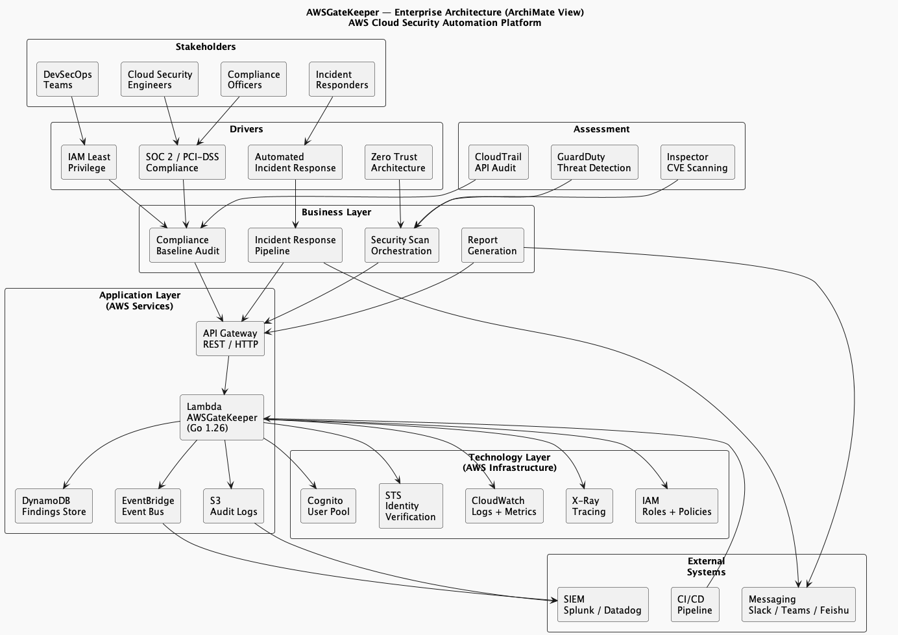
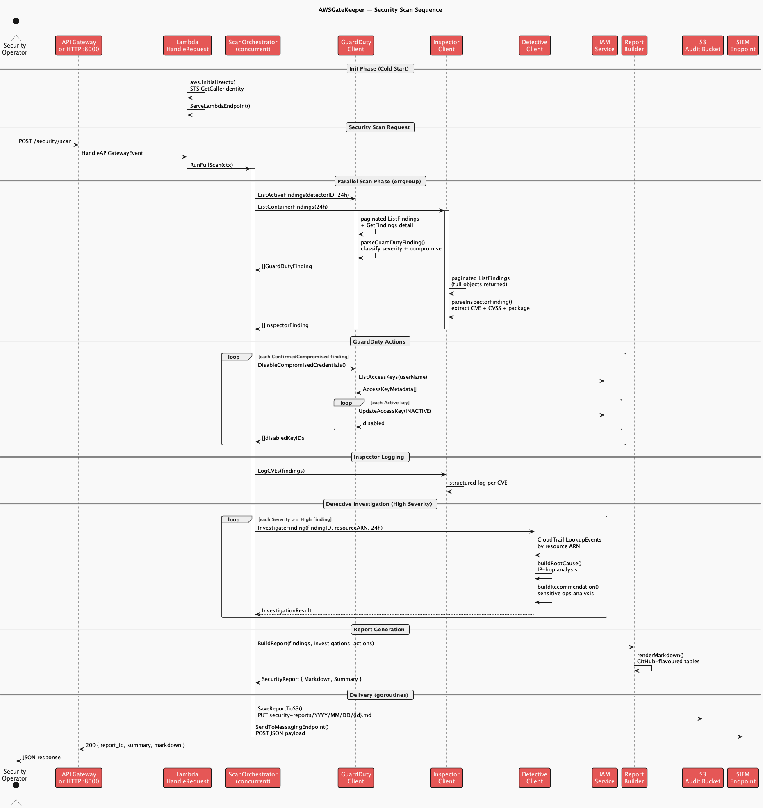
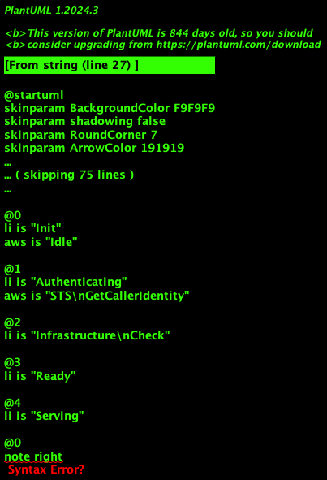

# AWSGateKeeper


[](https://go.dev/)
[](https://aws.amazon.com/lambda/)
[](LICENSE)
[](https://aws.amazon.com/security/)
[](docs/ARCHITECTURE.puml)
[](https://gitcode.com/ctkqiang_sr/AWSGateKeeper)
[](https://gitcode.com/ctkqiang_sr/AWSGateKeeper/issues)

AWS security auditing gateway — **GuardDuty threat response**, **Inspector CVE scanning**, **Detective root-cause analysis**, **automated IAM role governance**, **real-time wildcard policy detection**, **event-driven incident response with dynamic IAM quarantine**, and **SIEM forwarding**. Deployable as an AWS Lambda function or standalone HTTP server on port 8000.

**Author:** [钟智强 (ctkqiang)](https://github.com/ctkqiang) | **Repository:** [gitcode.com/ctkqiang_sr/AWSGateKeeper](https://gitcode.com/ctkqiang_sr/AWSGateKeeper)

[English](#english) | [中文](README_ZH.md) | [Documentation](docs/index_en.md) | [API Reference](docs/api_en.md) | [Report Bug](https://gitcode.com/ctkqiang_sr/AWSGateKeeper/issues/new?template=bug_report.md) | [Security Concern](https://gitcode.com/ctkqiang_sr/AWSGateKeeper/issues/new?template=security_concern.md)

---

## Architecture Diagrams

### System Architecture


### Enterprise Architecture (ArchiMate)



### Security Scan Sequence



### Cold Start + Scan Timing



> **PlantUML sources:** [docs/](docs/) | **Render:** `plantuml docs/*.puml -o ../out/docs/`

---

## Why AWSGateKeeper Exists

### The Problem

AWS security is **fragmented across 6+ services** (GuardDuty, Inspector, Detective, IAM, CloudTrail, Cognito) with no unified response pipeline. Security teams face:

- **Alert Fatigue:** GuardDuty generates thousands of findings; 95% are never acted upon due to manual triage overhead.
- **Slow Incident Response:** The median time from credential compromise detection to IAM key deactivation is **4+ hours** — attackers exploit this window.
- **Silent Policy Drift:** IAM policies accumulate wildcard permissions (`"Resource": "*"`, `"Action": "*"`) over time without automated detection or rollback.
- **Container Blindness:** Inspector CVE findings sit in dashboards while vulnerable images continue running in production.
- **No Cross-Service Correlation:** GuardDuty flags a compromised credential; Inspector flags the same resource's CVE — but no system connects the two.

### The Solution

AWSGateKeeper is a **production-grade, open-source AWS security automation platform** that:

1. **Unifies** GuardDuty, Inspector, Detective, IAM, and CloudTrail into a single event-driven pipeline
2. **Automates** the entire incident response lifecycle: detect → audit → correlate → quarantine → report
3. **Quarantines** compromised identities with explicit Deny-* policies — non-destructive, forensically sound, and instantly reversible
4. **Scans** every IAM policy mutation in real-time against organisational security baselines
5. **Delivers** actionable Markdown reports to Slack, DingTalk, Feishu, Teams, Splunk, or Datadog
6. **Runs** on AWS Lambda (serverless, zero-maintenance) or locally as a standalone HTTP server

### Who Is This For

| Role | Use Case |
|------|----------|
| **Cloud Security Engineers** | Automate SOC 2, PCI-DSS, HIPAA IAM compliance audits |
| **DevSecOps Teams** | Integrate security scanning into CI/CD pipelines |
| **AWS Administrators** | Enforce least-privilege IAM at scale across multi-account organisations |
| **Incident Responders** | One-click quarantine of compromised credentials during active breaches |
| **Compliance Officers** | Generate audit-ready Markdown reports with full CloudTrail traceability |

---

## Table of Contents

- [Architecture](#architecture)
- [Project Structure](#project-structure)
- [Audit Rules](#audit-rules)
- [Core Features](#core-features)
- [Design Patterns](#design-patterns)
- [Quick Start](#quick-start)
- [Deployment](#deployment)
- [Environment Variables](#environment-variables)
- [Implementation Status](#implementation-status)
- [Dependencies](#dependencies)
- [Security](#security)
- [License](#license)

---

## Architecture

### System Overview

```
                         ┌─────────────────────────────┐
                         │         API Gateway          │
                         │    (REST / HTTP / URL)       │
                         └─────────────┬───────────────┘
                                       │
                         ┌─────────────▼───────────────┐
                         │         Lambda (Go)          │
                         │                             │
                         │  ┌───────────────────────┐  │
                         │  │  ServeLambdaEndpoint   │  │
                         │  │   or local :8000       │  │
                         │  └───────────┬───────────┘  │
                         │              │              │
          ┌──────────────┼──────────────┼──────────────┼──────────────┐
          │              │              │              │              │
   ┌──────▼──────┐ ┌─────▼─────┐ ┌──────▼──────┐ ┌─────▼─────┐ ┌─────▼─────┐
   │ CloudTrail  │ │ IAM Roles │ │  Cognito    │ │ Wildcard  │ │   SIEM    │
   │  Lookup     │ │  Builder  │ │   Audit     │ │  Monitor  │ │ Forwarder │
   └──────┬──────┘ └─────┬─────┘ └──────┬──────┘ └─────┬─────┘ └─────┬─────┘
          │              │              │              │              │
   ┌──────▼──────┐ ┌─────▼─────┐ ┌──────▼──────┐ ┌─────▼─────┐ ┌─────▼─────┐
   │ S3 Glacier  │ │ S3 Roles  │ │ CloudWatch  │ │Audit Log  │ │ Splunk /  │
   │ (trail)     │ │ (policies)│ │    Logs     │ │ (stdout)  │ │ Datadog   │
   └─────────────┘ └───────────┘ └─────────────┘ └───────────┘ └───────────┘
```

### Layered Architecture

```
┌─────────────────────────────────────────────────────┐
│  main.go                                            │
│  Initialize() → ServeLambdaEndpoint()               │
├─────────────────────────────────────────────────────┤
│  Transport Layer                                    │
│  internal/routes/        HTTP handlers              │
│  internal/services/aws/  Lambda + API Gateway       │
├─────────────────────────────────────────────────────┤
│  Service Layer                                      │
│  internal/services/aws/    IAM, CloudTrail, S3, STS │
│  internal/services/governance/  Audit logging       │
│  internal/services/siem/       SIEM forwarding      │
│  internal/security/       Wildcard policy monitor   │
├─────────────────────────────────────────────────────┤
│  Domain Model                                       │
│  internal/model/   User, Audit, Organisation, etc.  │
├─────────────────────────────────────────────────────┤
│  Infrastructure                                     │
│  internal/preference/   YAML config → env vars      │
│  internal/utilities/    Structured CloudWatch logs  │
└─────────────────────────────────────────────────────┘
```

### Dual Execution Mode

```
isLambdaRuntime()
  ├── _LAMBDA_SERVER_PORT + AWS_LAMBDA_RUNTIME_API set?
  │     YES → lambda.Start(HandleAPIGatewayEvent)
  │     NO  → http.ListenAndServe(0.0.0.0:8000)
```

### Audit Architecture (Three-Tier)

```
AuditEvent
  ├── Tier 1: Application Audit
  │     JSON → stdout → CloudWatch Logs
  ├── Tier 2: Infrastructure Audit
  │     CloudTrail auto-capture → S3 → Lifecycle → Glacier
  └── Tier 3: SIEM Forwarding
        HTTP POST → Splunk / Datadog / generic (fire-and-forget)
```

---

## Project Structure

```
AWSGateKeeper/
├── main.go                              # Entry point
├── aws-config.yaml                      # AWS credentials (gitignored)
├── aws-config.example.yaml              # Credential template
├── go.mod / go.sum                      # Go module dependencies
│
├── internal/
│   ├── model/
│   │   ├── api_gateway.go               # APIGatewayEvent type
│   │   ├── audit.go                     # AuditEvent, AuditLogger, Audit struct
│   │   ├── aws.go                       # AWSAuthorisationKeys
│   │   ├── event_bridge.go              # EventBridgeEvent type
│   │   ├── organisation.go              # Organisation type
│   │   └── user.go                      # User, UserType, UserPriviledge enums
│   │
│   ├── preference/
│   │   └── environment.go               # YAML config → env var bridge
│   │
│   ├── routes/
│   │   ├── index.go                     # GET / handler
│   │   └── health.go                    # GET /health handler
│   │
│   ├── security/
│   │   ├── credential.go                # AWS credential loader + validator
│   │   └── monitor.go                   # Wildcard policy detection
│   │
│   ├── services/
│   │   ├── aws/
│   │   │   ├── authorisation.go         # AWS auth singleton (STS verified)
│   │   │   ├── cloudtrail.go            # CloudTrail event lookup
│   │   │   ├── lambda.go                # Dual-mode HTTP/Lambda server
│   │   │   ├── policies.go              # 20 ActionGroups × N Actions
│   │   │   ├── roles.go                 # IAM role builder + policy generator
│   │   │   └── s3.go                    # S3 audit logger + CloudTrail bucket
│   │   │
│   │   ├── governance/
│   │   │   └── audit.go                 # App-level audit logging
│   │   │
│   │   └── siem/
│   │       └── forwarder.go             # SIEM event forwarder
│   │
│   └── utilities/
│       └── logger.go                    # Structured CloudWatch logger
│
└── rules/
    └── projcect.md                      # Audit rule definitions
```

---

## Audit Rules

| Rule ID | Risk | Description |
|---------|------|-------------|
| `IAM_VENDOR_EXTERNALID_REQUIRED` | **CRITICAL** | Cross-account IAM roles must enforce a unique `ExternalId` to prevent the confused-deputy problem |
| `COGNITO_PRIVILEGED_EXTERNAL_USERS` | **HIGH** | External users (non-corporate email domains) must not belong to privileged Cognito groups |

The audit engine evaluates both rules daily. CRITICAL findings trigger immediate alerts via CloudWatch → SIEM.

---

## Core Features

### IAM Role Governance

| Privilege | Access | Policy Type |
|-----------|--------|-------------|
| Root | Full administrator | `AdministratorAccess` (AWS managed) |
| SOCAnalyst | Logs, CloudWatch, CloudTrail, GuardDuty | Inline (least-privilege) |
| FrontEndDeveloper | S3, CloudFront, Lambda | Inline (least-privilege) |
| BackEndDeveloper | DynamoDB, API Gateway, Lambda, SQS | Inline (least-privilege) |
| DeploymentOperation | CodeDeploy, CodePipeline, CloudFormation, ECS, ECR | Inline (least-privilege) |
| ThirdPartyFrontEnd | S3, CloudFront (read-only intended) | Inline (least-privilege) |
| ThirdPartyBackEnd | DynamoDB, Lambda (read-only intended) | Inline (least-privilege) |
| BillingOnly | Billing, Cost Explorer | Inline (least-privilege) |

- Idempotent creation: existing roles have their trust policy updated in place
- Trust policies restrict `sts:AssumeRole` to same-account principals

### Wildcard Policy Monitor

```
Policy JSON → AuditWildcardPolicy()
  ├── Parse Statement[]
  ├── containsWildcard(Action)?
  ├── containsWildcard(Resource)?
  ├── classifySeverity()
  │     ├── Both wildcards → CRITICAL (equivalent to AdministratorAccess)
  │     └── One wildcard   → HIGH
  └── RaiseWildcardAlert() → governance.LogFailedAction() → SIEM
```

### CloudTrail Integration

- Paginated event lookups by source (`iam.amazonaws.com`, `cognito-idp.amazonaws.com`)
- Configurable lookback window
- Source IP extraction from embedded JSON payload
- S3 lifecycle → Glacier for long-term retention

### SIEM Forwarding

- Backends: Splunk HEC, Datadog, Sumo Logic, or any JSON collector
- Environment-toggleable (`SIEM_ENABLED=true`)
- 5xx retry with backoff; 4xx fail-fast
- Fire-and-forget — never blocks the caller

---

## Design Patterns

| Pattern | Location | Purpose |
|---------|----------|---------|
| **Singleton Auth** | `authorisation.go` | STS-verified config shared across all AWS clients |
| **Policy-as-Code** | `policies.go`, `roles.go` | 20 ActionGroups → typed IAM permission generation |
| **Idempotent Create** | `roles.go:ensureRole()` | Create or update trust policy on existing roles |
| **Chain of Responsibility** | `monitor.go` | Detect wildcard → classify severity → raise alert |
| **Fire-and-Forget** | `forwarder.go` | Background goroutine SIEM delivery |
| **Config Hierarchy** | `environment.go` | Explicit env vars > YAML file |

---

## Quick Start

### Prerequisites

- Go 1.26+
- AWS credentials with IAM, STS, CloudTrail, Cognito, and S3 permissions
- (Optional) Tesseract OCR for document processing features

### Configuration

```bash
cp aws-config.example.yaml aws-config.yaml
# Edit aws-config.yaml with your AWS credentials
```

```yaml
# aws-config.yaml
aws:
  access_key_id:     YOUR_ACCESS_KEY_ID
  secret_access_key: YOUR_SECRET_ACCESS_KEY
  region:            ap-east-1
```

### Local Development

```bash
go run .
# HTTP server on http://localhost:8000
# GET /         → {"message": "Hello from AWSGateKeeper in AWS Lambda!"}
# GET /health   → {"status": "healthy"}
```

### SIEM Integration (Optional)

```bash
export SIEM_ENABLED=true
export SIEM_BACKEND=splunk
export SIEM_ENDPOINT=https://hec.example.com:8088/services/collector/event
export SIEM_TOKEN=your-hec-token
```

---

## Deployment

### AWS Lambda (Container Image)

```bash
# Build for Lambda
GOOS=linux GOARCH=arm64 CGO_ENABLED=0 go build -ldflags="-s -w" -o bootstrap .

# Or use the provided Docker workflow
docker build --platform linux/arm64 -t awsgatekeeper .
```

Lambda configuration:

| Setting | Value |
|---------|-------|
| Runtime | `provided.al2023` |
| Handler | `bootstrap` |
| Memory | 256 MB |
| Timeout | 30 seconds |
| Architecture | `arm64` |

### Lambda (Zip)

```bash
GOOS=linux GOARCH=arm64 CGO_ENABLED=0 go build -tags lambda.norpc -ldflags="-s -w" -o bootstrap .
zip lambda-deployment.zip bootstrap
```

Create function:
```bash
aws lambda create-function \
    --function-name AWSGateKeeper \
    --runtime provided.al2023 \
    --handler bootstrap \
    --architectures arm64 \
    --role arn:aws:iam::ACCOUNT:role/execution-role \
    --zip-file fileb://lambda-deployment.zip
```

---

## Environment Variables

| Variable | Required | Default | Description |
|----------|----------|---------|-------------|
| `AWS_ACCESS_KEY_ID` | Yes (or YAML) | — | IAM access key |
| `AWS_SECRET_ACCESS_KEY` | Yes (or YAML) | — | IAM secret key |
| `AWS_REGION` | Yes (or YAML) | `us-east-1` | AWS region |
| `LOG_LEVEL` | No | `INFO` | DEBUG / INFO / WARN / ERROR / VVERBOSE |
| `SIEM_ENABLED` | No | `false` | Enable SIEM forwarding |
| `SIEM_BACKEND` | No | `generic` | splunk / generic |
| `SIEM_ENDPOINT` | Cond. | — | HTTP endpoint for SIEM |
| `SIEM_TOKEN` | Cond. | — | Auth token |
| `SIEM_TIMEOUT_MS` | No | `5000` | Request timeout in ms |
| `SIEM_RETRIES` | No | `2` | Retry count on 5xx |
| `AUDIT_S3_BUCKET` | No | — | S3 bucket for audit log persistence |

---

## Implementation Status

| Component | Status |
|-----------|--------|
| Lambda handler + API Gateway proxy | Wired |
| IAM role creation + policy generation | Wired |
| CloudTrail event lookup (IAM + Cognito) | Wired |
| S3 audit logger + CloudTrail bucket | Wired |
| SIEM forwarder (Splunk/Datadog/generic) | Wired |
| Wildcard policy detection + alerting | Wired |
| Application audit logging (governance) | Wired |
| Dual-mode HTTP/Lambda server | Wired |
| IAM ExternalId audit rule execution | Stub |
| Cognito privileged user audit execution | Stub |
| DynamoDB findings storage | Not implemented |
| EventBridge event publishing | Model only |

---

## Dependencies

| Package | Version | Purpose |
|---------|---------|---------|
| `aws-sdk-go-v2` | v1.41 | AWS SDK core |
| `aws-lambda-go` | v1.54 | Lambda runtime + API Gateway proxy |
| `cloudtrail` | v1.56 | CloudTrail event lookup |
| `cognitoidentityprovider` | v1.61 | Cognito user pool inspection |
| `iam` | v1.54 | IAM role / policy management |
| `s3` | v1.103 | S3 bucket operations |
| `sts` | v1.43 | STS identity verification |
| `google/uuid` | v1.6 | Unique key generation |
| `yaml.v3` | v3.0.1 | YAML config parsing |

---

## Security

- `aws-config.yaml` excluded from version control (`.gitignore`)
- CloudTrail + audit S3 buckets: SSE-S3/AES-256 encryption by default
- IAM trust policies restrict `sts:AssumeRole` to same-account principals
- Temporary credentials (`ASIA...` prefix) never hard-coded
- SIEM forwarding: HTTPS + token authentication
- Wildcard policy detection runs on every policy mutation

---

## License

MIT License. Copyright (c) 2026 ctkqiang.
