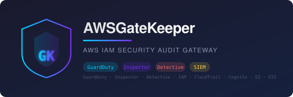

# AWSGateKeeper — AWS 安全审计网关



[](https://go.dev/)
[](https://aws.amazon.com/lambda/)
[](LICENSE)
[](https://aws.amazon.com/security/)
[](docs/ARCHITECTURE.puml)
[](https://gitcode.com/ctkqiang_sr/AWSGateKeeper)
[](https://gitcode.com/ctkqiang_sr/AWSGateKeeper/issues)

AWS 安全审计网关 — **GuardDuty 威胁响应**、**Inspector CVE 扫描**、**Detective 根因分析**、**IAM 角色自动化治理**、**通配符策略实时检测**、**事件驱动的事件响应与动态 IAM 隔离**、**SIEM 转发**。可部署为 AWS Lambda 函数或端口 8000 上的独立 HTTP 服务器。

**作者:** [钟智强 (ctkqiang)](https://github.com/ctkqiang) | **仓库:** [gitcode.com/ctkqiang_sr/AWSGateKeeper](https://gitcode.com/ctkqiang_sr/AWSGateKeeper)

---

## 为什么存在 AWSGateKeeper

### 问题

AWS 安全**分散在 6 个以上的服务中**（GuardDuty、Inspector、Detective、IAM、CloudTrail、Cognito），没有统一的响应管道。安全团队面临：

- **告警疲劳：** GuardDuty 生成数千条发现；由于人工分类开销，95% 从未被处理。
- **事件响应缓慢：** 从检测到凭证泄露到停用 IAM 密钥的中位时间为 **4 小时以上**——攻击者利用这个窗口。
- **静默策略漂移：** IAM 策略随时间累积通配符权限（`"Resource": "*"`、`"Action": "*"`），没有自动检测或回滚。
- **容器盲点：** Inspector CVE 发现停留在仪表盘中，而有漏洞的镜像仍在生产环境中运行。
- **无跨服务关联：** GuardDuty 标记了受损凭证；Inspector 标记了同一资源的 CVE——但没有系统将两者关联起来。

### 解决方案

AWSGateKeeper 是一个**生产级、开源的 AWS 安全自动化平台**：

1. **统一** GuardDuty、Inspector、Detective、IAM 和 CloudTrail 到单一事件驱动管道
2. **自动化** 整个事件响应生命周期：检测 → 审计 → 关联 → 隔离 → 报告
3. **隔离** 受损身份，使用显式 Deny-* 策略——非破坏性、符合取证要求、可即时撤销
4. **扫描** 每次 IAM 策略变更，对照组织安全基线进行实时审计
5. **投递** 可执行的 Markdown 报告到 Slack、钉钉、飞书、Teams、Splunk 或 Datadog
6. **运行** 在 AWS Lambda（无服务器、零维护）或本地作为独立 HTTP 服务器

### 适用人群

| 角色 | 用例 |
|------|----------|
| **云安全工程师** | 自动化 SOC 2、PCI-DSS、HIPAA IAM 合规审计 |
| **DevSecOps 团队** | 将安全扫描集成到 CI/CD 管道 |
| **AWS 管理员** | 在多账户组织中大规模强制执行最小权限 IAM |
| **事件响应人员** | 在活跃入侵期间一键隔离受损凭证 |
| **合规官** | 生成附带完整 CloudTrail 可追溯性的审计就绪 Markdown 报告 |

[English](README.md) | [中文](#中文) | [文档](docs/index_zh.md) | [API 参考](docs/api_zh.md)

---

## 目录

- [系统架构](#系统架构)
- [项目结构](#项目结构)
- [审计规则](#审计规则)
- [核心功能](#核心功能)
- [设计模式](#设计模式)
- [快速开始](#快速开始)
- [部署](#部署)
- [环境变量](#环境变量)
- [实现状态](#实现状态)
- [依赖项](#依赖项)
- [安全措施](#安全措施)
- [许可证](#许可证)

---

## 系统架构

### 架构总览

```
                         ┌─────────────────────────────┐
                         │         API Gateway          │
                         │    (REST / HTTP / URL)       │
                         └─────────────┬───────────────┘
                                       │
                         ┌─────────────▼───────────────┐
                         │         Lambda (Go)          │
                         │                             │
                         │  ┌───────────────────────┐  │
                         │  │  ServeLambdaEndpoint   │  │
                         │  │   或本地 :8000         │  │
                         │  └───────────┬───────────┘  │
                         │              │              │
          ┌──────────────┼──────────────┼──────────────┼──────────────┐
          │              │              │              │              │
   ┌──────▼──────┐ ┌─────▼─────┐ ┌──────▼──────┐ ┌─────▼─────┐ ┌─────▼─────┐
   │ CloudTrail  │ │ IAM 角色  │ │  Cognito    │ │ 通配符    │ │   SIEM    │
   │  事件查询   │ │  构建器   │ │   审计      │ │  监控器   │ │  转发器   │
   └──────┬──────┘ └─────┬─────┘ └──────┬──────┘ └─────┬─────┘ └─────┬─────┘
          │              │              │              │              │
   ┌──────▼──────┐ ┌─────▼─────┐ ┌──────▼──────┐ ┌─────▼─────┐ ┌─────▼─────┐
   │ S3 Glacier  │ │ S3 角色   │ │ CloudWatch  │ │ 审计日志  │ │ Splunk /  │
   │ (跟踪日志)  │ │ (策略)    │ │    Logs     │ │ (stdout)  │ │ Datadog   │
   └─────────────┘ └───────────┘ └─────────────┘ └───────────┘ └───────────┘
```

### 分层架构

```
┌─────────────────────────────────────────────────────┐
│  main.go                                            │
│  Initialize() → ServeLambdaEndpoint()               │
├─────────────────────────────────────────────────────┤
│  传输层                                             │
│  internal/routes/        HTTP 处理器                │
│  internal/services/aws/  Lambda + API Gateway       │
├─────────────────────────────────────────────────────┤
│  服务层                                             │
│  internal/services/aws/    IAM, CloudTrail, S3, STS │
│  internal/services/governance/  审计日志            │
│  internal/services/siem/        SIEM 转发           │
│  internal/security/        通配符策略监控           │
├─────────────────────────────────────────────────────┤
│  领域模型                                           │
│  internal/model/   User, Audit, Organisation 等     │
├─────────────────────────────────────────────────────┤
│  基础设施                                           │
│  internal/preference/   YAML 配置 → 环境变量        │
│  internal/utilities/    结构化 CloudWatch 日志      │
└─────────────────────────────────────────────────────┘
```

### 双模执行

```
isLambdaRuntime()
  ├── _LAMBDA_SERVER_PORT + AWS_LAMBDA_RUNTIME_API 均存在？
  │     YES → lambda.Start(HandleAPIGatewayEvent)   // AWS Lambda
  │     NO  → http.ListenAndServe(0.0.0.0:8000)     // 本地开发
```

### 三级审计架构

```
AuditEvent
  ├── 第一级：应用审计
  │     JSON → stdout → CloudWatch Logs
  ├── 第二级：基础设施审计
  │     CloudTrail 自动捕获 → S3 → 生命周期 → Glacier
  └── 第三级：SIEM 转发
        HTTP POST → Splunk / Datadog / 通用采集器（异步）
```

---

## 项目结构

```
AWSGateKeeper/
├── main.go                              # 入口文件
├── aws-config.yaml                      # AWS 凭证（git 忽略）
├── aws-config.example.yaml              # 凭证模板
├── go.mod / go.sum                      # Go 模块依赖
│
├── internal/
│   ├── model/
│   │   ├── api_gateway.go               # APIGatewayEvent 类型
│   │   ├── audit.go                     # AuditEvent, AuditLogger, Audit
│   │   ├── aws.go                       # AWSAuthorisationKeys
│   │   ├── event_bridge.go              # EventBridgeEvent 类型
│   │   ├── organisation.go              # Organisation 类型
│   │   └── user.go                      # User, UserType, UserPriviledge
│   │
│   ├── preference/
│   │   └── environment.go               # YAML 配置 → 环境变量桥接
│   │
│   ├── routes/
│   │   ├── index.go                     # GET / 处理器
│   │   └── health.go                    # GET /health 处理器
│   │
│   ├── security/
│   │   ├── credential.go                # AWS 凭证加载 + 验证
│   │   └── monitor.go                   # 通配符策略检测
│   │
│   ├── services/
│   │   ├── aws/
│   │   │   ├── authorisation.go         # AWS 认证单例（STS 验证）
│   │   │   ├── cloudtrail.go            # CloudTrail 事件查询
│   │   │   ├── lambda.go                # 双模 HTTP/Lambda 服务器
│   │   │   ├── policies.go              # 20 个 ActionGroup × N 个 Action
│   │   │   ├── roles.go                 # IAM 角色构建器 + 策略生成
│   │   │   └── s3.go                    # S3 审计日志 + CloudTrail 桶
│   │   │
│   │   ├── governance/
│   │   │   └── audit.go                 # 应用层审计日志
│   │   │
│   │   └── siem/
│   │       └── forwarder.go             # SIEM 事件转发器
│   │
│   └── utilities/
│       └── logger.go                    # 结构化 CloudWatch 日志
│
└── rules/
    └── projcect.md                      # 审计规则定义
```

---

## 审计规则

| 规则 ID | 风险等级 | 描述 |
|---------|----------|------|
| `IAM_VENDOR_EXTERNALID_REQUIRED` | **严重** | 跨账户 IAM 角色必须强制使用唯一 `ExternalId`，防止混淆代理攻击 |
| `COGNITO_PRIVILEGED_EXTERNAL_USERS` | **高** | 非企业邮件域的外部用户不得属于高权限 Cognito 用户组 |

审计引擎每日评估两项规则。严重发现通过 CloudWatch → SIEM 触发即时告警。

---

## 核心功能

### IAM 角色治理

| 权限等级 | 访问范围 | 策略类型 |
|-----------|--------|-------------|
| Root | 完全管理员 | `AdministratorAccess`（AWS 托管） |
| SOCAnalyst | Logs, CloudWatch, CloudTrail, GuardDuty | 内联（最小权限） |
| FrontEndDeveloper | S3, CloudFront, Lambda | 内联（最小权限） |
| BackEndDeveloper | DynamoDB, API Gateway, Lambda, SQS | 内联（最小权限） |
| DeploymentOperation | CodeDeploy, CodePipeline, CloudFormation, ECS, ECR | 内联（最小权限） |
| ThirdPartyFrontEnd | S3, CloudFront（预期只读） | 内联（最小权限） |
| ThirdPartyBackEnd | DynamoDB, Lambda（预期只读） | 内联（最小权限） |
| BillingOnly | Billing, Cost Explorer | 内联（最小权限） |

- 幂等创建：已存在的角色原地更新信任策略
- 信任策略限制 `sts:AssumeRole` 仅限同账户主体

### 通配符策略监控

```
策略 JSON → AuditWildcardPolicy()
  ├── 解析 Statement[]
  ├── containsWildcard(Action)?
  ├── containsWildcard(Resource)?
  ├── classifySeverity()
  │     ├── 双通配符 → CRITICAL（等同于 AdministratorAccess）
  │     └── 单通配符 → HIGH
  └── RaiseWildcardAlert() → governance.LogFailedAction() → SIEM
```

### CloudTrail 集成

- 按事件源分页查询（`iam.amazonaws.com`、`cognito-idp.amazonaws.com`）
- 可配置回溯时间窗口
- 从嵌入式 JSON 提取来源 IP
- S3 生命周期 → Glacier 长期归档

### SIEM 转发

- 支持后端：Splunk HEC、Datadog、Sumo Logic、通用 JSON 采集器
- 环境变量开关（`SIEM_ENABLED=true`）
- 5xx 自动重试带退避；4xx 快速失败
- 异步投递——永不阻塞调用方

---

## 设计模式

| 模式 | 位置 | 用途 |
|---------|----------|---------|
| **单例认证** | `authorisation.go` | STS 验证配置，所有 AWS 客户端共享 |
| **策略即代码** | `policies.go`, `roles.go` | 20 个 ActionGroup → 类型安全 IAM 权限生成 |
| **幂等创建** | `roles.go:ensureRole()` | 不存在则创建，已存在则更新信任策略 |
| **责任链** | `monitor.go` | 检测通配符 → 分类严重级别 → 触发告警 |
| **异步投递** | `forwarder.go` | 后台 goroutine SIEM 投递 |
| **配置层级** | `environment.go` | 显式环境变量 > YAML 文件 |

---

## 快速开始

### 前置条件

- Go 1.26+
- 具备 IAM、STS、CloudTrail、Cognito 和 S3 权限的 AWS 凭证

### 配置

```bash
cp aws-config.example.yaml aws-config.yaml
# 编辑 aws-config.yaml，填入 AWS 凭证
```

```yaml
# aws-config.yaml
aws:
  access_key_id:     YOUR_ACCESS_KEY_ID
  secret_access_key: YOUR_SECRET_ACCESS_KEY
  region:            ap-east-1
```

### 本地开发

```bash
go run .
# HTTP 服务启动在 http://localhost:8000
# GET /         → {"message": "Hello from AWSGateKeeper in AWS Lambda!"}
# GET /health   → {"status": "healthy"}
```

### SIEM 集成（可选）

```bash
export SIEM_ENABLED=true
export SIEM_BACKEND=splunk
export SIEM_ENDPOINT=https://hec.example.com:8088/services/collector/event
export SIEM_TOKEN=your-hec-token
```

---

## 部署

### AWS Lambda（容器镜像）

```bash
# 构建 Lambda 二进制
GOOS=linux GOARCH=arm64 CGO_ENABLED=0 go build -ldflags="-s -w" -o bootstrap .

# 或使用 Docker 工作流
docker build --platform linux/arm64 -t awsgatekeeper .
```

Lambda 配置：

| 设置 | 值 |
|---------|-------|
| 运行时 | `provided.al2023` |
| 处理器 | `bootstrap` |
| 内存 | 256 MB |
| 超时 | 30 秒 |
| 架构 | `arm64` |

### Lambda（Zip 包）

```bash
GOOS=linux GOARCH=arm64 CGO_ENABLED=0 go build -tags lambda.norpc -ldflags="-s -w" -o bootstrap .
zip lambda-deployment.zip bootstrap
```

创建函数：
```bash
aws lambda create-function \
    --function-name AWSGateKeeper \
    --runtime provided.al2023 \
    --handler bootstrap \
    --architectures arm64 \
    --role arn:aws:iam::ACCOUNT:role/execution-role \
    --zip-file fileb://lambda-deployment.zip
```

---

## 环境变量

| 变量 | 是否必须 | 默认值 | 描述 |
|------|----------|--------|------|
| `AWS_ACCESS_KEY_ID` | 是（或 YAML） | — | IAM 访问密钥 |
| `AWS_SECRET_ACCESS_KEY` | 是（或 YAML） | — | IAM 私有密钥 |
| `AWS_REGION` | 是（或 YAML） | `us-east-1` | AWS 区域 |
| `LOG_LEVEL` | 否 | `INFO` | DEBUG / INFO / WARN / ERROR / VVERBOSE |
| `SIEM_ENABLED` | 否 | `false` | 启用 SIEM 转发 |
| `SIEM_BACKEND` | 否 | `generic` | splunk / generic |
| `SIEM_ENDPOINT` | 条件 | — | SIEM HTTP 端点 |
| `SIEM_TOKEN` | 条件 | — | 认证令牌 |
| `SIEM_TIMEOUT_MS` | 否 | `5000` | 请求超时（毫秒） |
| `SIEM_RETRIES` | 否 | `2` | 5xx 重试次数 |
| `AUDIT_S3_BUCKET` | 否 | — | 审计日志 S3 桶 |

---

## 实现状态

| 组件 | 状态 |
|-----------|--------|
| Lambda 处理器 + API Gateway 代理 | 已实现 |
| IAM 角色创建 + 策略生成 | 已实现 |
| CloudTrail 事件查询（IAM + Cognito） | 已实现 |
| S3 审计日志 + CloudTrail 桶管理 | 已实现 |
| SIEM 转发器（Splunk/Datadog/通用） | 已实现 |
| 通配符策略检测 + 告警 | 已实现 |
| 应用审计日志（governance） | 已实现 |
| 双模 HTTP/Lambda 服务 | 已实现 |
| IAM ExternalId 审计规则执行 | 骨架 |
| Cognito 特权用户审计执行 | 骨架 |
| DynamoDB 发现物存储 | 未实现 |
| EventBridge 事件发布 | 仅模型 |

---

## 依赖项

| 包 | 版本 | 用途 |
|----|------|------|
| `aws-sdk-go-v2` | v1.41 | AWS SDK 核心 |
| `aws-lambda-go` | v1.54 | Lambda 运行时 + API Gateway 代理 |
| `cloudtrail` | v1.56 | CloudTrail 事件查询 |
| `cognitoidentityprovider` | v1.61 | Cognito 用户池检查 |
| `iam` | v1.54 | IAM 角色/策略管理 |
| `s3` | v1.103 | S3 桶操作 |
| `sts` | v1.43 | STS 身份验证 |
| `google/uuid` | v1.6 | 唯一键生成 |
| `yaml.v3` | v3.0.1 | YAML 配置解析 |

---

## 安全措施

- `aws-config.yaml` 已排除出版本控制（`.gitignore`）
- CloudTrail + 审计 S3 桶默认启用 SSE-S3/AES-256 加密
- IAM 信任策略限制 `sts:AssumeRole` 仅限同一账户
- 临时凭证（`ASIA...` 前缀）从不硬编码
- SIEM 转发使用 HTTPS + 令牌认证
- 每次策略变更时运行通配符检测

---

## 许可证

MIT License. Copyright (c) 2026 ctkqiang.
