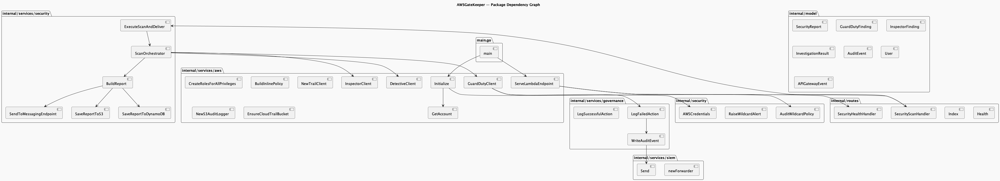

# Architecture

## System Architecture



AWSGateKeeper follows a **five-layer architecture with strict one-way dependency flow**. The system is deployable as either an AWS Lambda function behind API Gateway or a standalone HTTP server on `0.0.0.0:8000`.

### Five-Layer Design

```
main.go
  └─ aws.Initialize() → ServeLambdaEndpoint(scanFunc, healthFunc)
       │
       ├─ Transport Layer: routes/*
       │    GET /, /health, POST /security/scan, GET /security/health
       │
       ├─ Orchestration Layer: services/security/*
       │    ScanOrchestrator (errgroup parallel GuardDuty+Inspector)
       │    IncidentHandler (CloudTrail→audit→correlate→quarantine→report)
       │    QuarantineEngine (Deny-* policy + key deactivation)
       │
       ├─ AWS Client Layer: services/aws/*
       │    GuardDutyClient (15 APIs), InspectorClient, DetectiveClient
       │    IAM role builder, S3 audit logger, CloudTrail query
       │
       ├─ Domain Layer: model/*
       │    User, Audit, SecurityReport, GuardDutyFinding, IncidentRecord
       │
       └─ Infrastructure Layer:
            preference/ (YAML→env), utilities/ (CloudWatch logger)
            governance/ (audit), siem/ (SIEM forwarding), security/ (wildcard)
```

### Data Flow — Security Scan

```
POST /security/scan
        │
  ┌─────▼──────────────────────────────┐
  │  ScanOrchestrator.RunFullScan(ctx)  │
  │                                     │
  │  ┌─ errgroup ────────────────────┐  │
  │  │  goroutine 1: GuardDuty scan  │  │
  │  │  goroutine 2: Inspector scan  │  │
  │  └───────────────────────────────┘  │
  │            │ (parallel)             │
  │            ▼                        │
  │  Findings aggregated                │
  │            │                        │
  │  ┌────────▼──────────────────────┐  │
  │  │  For each ConfirmedCompromised │  │
  │  │  → DisableCompromisedCredentials│  │
  │  │  For each Severity >= High     │  │
  │  │  → Detective.InvestigateFinding│  │
  │  └───────────────────────────────┘  │
  │            │                        │
  │            ▼                        │
  │  BuildReport() → Markdown           │
  │            │                        │
  │  ┌────────▼──────────────────────┐  │
  │  │  goroutine: S3 PutObject       │  │
  │  │  goroutine: DynamoDB PutItem   │  │
  │  │  goroutine: Webhook POST       │  │
  │  └───────────────────────────────┘  │
  └─────────────────────────────────────┘
        │
  200 JSON { report_id, markdown, findings, ... }
```

### Incident Response Pipeline

```
CloudTrail Event → EventBridge → IncidentHandler.ProcessCloudTrailEvent()
                                          │
  Phase 1: Audit ─────────────────────────┤
  ├─ AuditWildcardPolicy() (wildcard check)
  └─ hasCrossAccountTrust() (ExternalId check)
                                          │
  Phase 2: Correlate ─────────────────────┤
  └─ GuardDuty.ListActiveFindings() → threat score 0.0–10.0
                                          │
  Phase 3: Quarantine ────────────────────┤
  ├─ shouldQuarantine? (CRITICAL or score >= 7.0)
  └─ QuarantineEngine.QuarantineIdentity()
       ├─ PutUserPolicy / PutRolePolicy (Deny-*)
       ├─ ListAccessKeys + UpdateAccessKey(INACTIVE)
       └─ Session invalidation (Deny-* enforcement)
                                          │
  Phase 4: Report ────────────────────────┤
  ├─ renderIncidentMarkdown()
  └─ SendToMessagingEndpoint() (webhook POST)
```

### GuardDuty API Coverage

| Tier | Feature | SDK Method |
|------|---------|------------|
| 0 | ListFindings + GetFindings | `ListFindings`, `GetFindings` |
| 0 | Severity classification + network scan detection | (internal logic) |
| 0 | Compromised credential → IAM key disable | `ListAccessKeys`, `UpdateAccessKey` |
| 1 | Findings Statistics | `GetFindingsStatistics` |
| 1 | Archive / Unarchive Findings | `ArchiveFindings`, `UnarchiveFindings` |
| 1 | Sample Findings Generation | `CreateSampleFindings` |
| 1 | Findings Feedback | `UpdateFindingsFeedback` |
| 2 | Threat Intelligence Sets (CRUD) | `ListThreatIntelSets`, `GetThreatIntelSet` |
| 2 | Trusted Entity Sets (CRUD) | `ListThreatIntelSets` |
| 2 | Publishing Destinations | `ListPublishingDestinations` |
| 2 | Coverage Statistics | `GetCoverageStatistics` |
| 3 | Member Accounts | `ListMembers` |
| 3 | Organization Statistics | `GetOrganizationStatistics` |

### Dual-Mode Execution

```
isLambdaRuntime()
  ├── _LAMBDA_SERVER_PORT + AWS_LAMBDA_RUNTIME_API set?
  │     YES → lambda.Start(HandleAPIGatewayEvent)
  │     NO  → http.ListenAndServe(0.0.0.0:8000)
```

### Key Design Decisions

| Decision | Rationale |
|----------|-----------|
| **Closure injection for routes** | Avoids Go import cycle between `services/aws` and `services/security` |
| **Singleton auth via STS** | One verified SDK config shared across all 5+ AWS service clients |
| **errgroup for parallel scans** | GuardDuty + Inspector run concurrently; ~2x speedup vs sequential |
| **Deny-* quarantine, never delete** | Identity can still authenticate for forensics; policy blocks all actions |
| **Fire-and-forget delivery** | S3 + DynamoDB + webhook run in background goroutines; HTTP response returns immediately |
| **Policy-as-Code** | 20 ActionGroups with typed constants generate IAM policies |
| **Idempotent role creation** | CreateRole fails → UpdateAssumeRolePolicy on existing roles |
| **Config hierarchy** | Environment variables > YAML file > SDK defaults |

### No Import Cycles

```
main → services/aws + services/security     (leaf imports)
services/aws → routes                        (one-way)
routes → stdlib only                         (no internal deps)
services/security → services/aws             (one-way)
```
