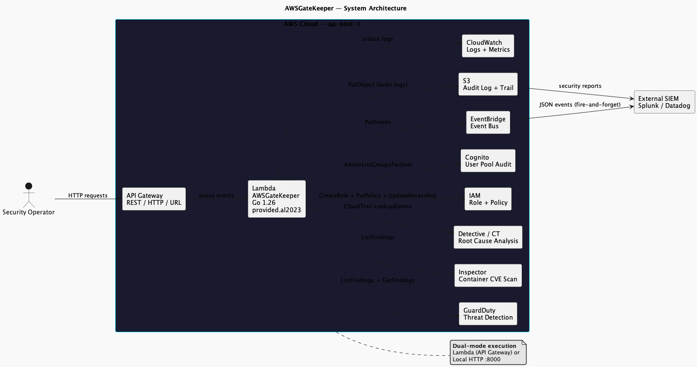

# 系统架构

## 系统架构



AWSGateKeeper 采用**五层架构，依赖严格单向向下**。可作为 API Gateway 后的 AWS Lambda 函数部署，也可作为 `0.0.0.0:8000` 上的独立 HTTP 服务器运行。

### 五层设计

```
main.go
  └─ aws.Initialize() → ServeLambdaEndpoint(scanFunc, healthFunc)
       │
       ├─ 传输层: routes/*
       │    GET /, /health, POST /security/scan, GET /security/health
       │
       ├─ 编排层: services/security/*
       │    ScanOrchestrator (errgroup 并发 GuardDuty+Inspector)
       │    IncidentHandler (CloudTrail→审计→关联→隔离→报告)
       │    QuarantineEngine (Deny-* 策略+密钥停用)
       │
       ├─ AWS 客户端层: services/aws/*
       │    GuardDutyClient (15 API), InspectorClient, DetectiveClient
       │    IAM角色构建, S3审计日志, CloudTrail查询
       │
       ├─ 领域层: model/*
       │    User, Audit, SecurityReport, GuardDutyFinding, IncidentRecord
       │
       └─ 基础设施层:
            preference/ (YAML→env), utilities/ (CloudWatch日志)
            governance/ (审计), siem/ (SIEM转发), security/ (通配符检测)
```

### 数据流 — 安全扫描

```
POST /security/scan
        │
  ┌─────▼──────────────────────────────┐
  │  ScanOrchestrator.RunFullScan(ctx)  │
  │                                     │
  │  ┌─ errgroup ────────────────────┐  │
  │  │  goroutine 1: GuardDuty 扫描  │  │
  │  │  goroutine 2: Inspector 扫描  │  │
  │  └───────────────────────────────┘  │
  │            │ (并行)                 │
  │            ▼                        │
  │  发现汇总                            │
  │            │                        │
  │  ┌────────▼──────────────────────┐  │
  │  │  每条 ConfirmedCompromised     │  │
  │  │  → DisableCompromisedCredentials│  │
  │  │  每条 Severity >= High         │  │
  │  │  → Detective.InvestigateFinding│  │
  │  └───────────────────────────────┘  │
  │            │                        │
  │            ▼                        │
  │  BuildReport() → Markdown           │
  │            │                        │
  │  ┌────────▼──────────────────────┐  │
  │  │  goroutine: S3 PutObject       │  │
  │  │  goroutine: DynamoDB PutItem   │  │
  │  │  goroutine: Webhook POST       │  │
  │  └───────────────────────────────┘  │
  └─────────────────────────────────────┘
        │
  200 JSON { report_id, markdown, findings, ... }
```

### 事件响应管道

```
CloudTrail 事件 → EventBridge → IncidentHandler.ProcessCloudTrailEvent()
                                          │
  阶段 1: 审计 ────────────────────────────┤
  ├─ AuditWildcardPolicy() (通配符检查)
  └─ hasCrossAccountTrust() (ExternalId 检查)
                                          │
  阶段 2: 关联 ────────────────────────────┤
  └─ GuardDuty.ListActiveFindings() → 威胁评分 0.0–10.0
                                          │
  阶段 3: 隔离 ────────────────────────────┤
  ├─ shouldQuarantine? (CRITICAL 或 评分 >= 7.0)
  └─ QuarantineEngine.QuarantineIdentity()
       ├─ PutUserPolicy / PutRolePolicy (Deny-*)
       ├─ ListAccessKeys + UpdateAccessKey(INACTIVE)
       └─ 会话失效 (Deny-* 强制执行)
                                          │
  阶段 4: 报告 ────────────────────────────┤
  ├─ renderIncidentMarkdown()
  └─ SendToMessagingEndpoint() (webhook POST)
```

### GuardDuty API 覆盖

| 层级 | 功能 | SDK 方法 |
|------|------|----------|
| 0 | ListFindings + GetFindings | `ListFindings`, `GetFindings` |
| 0 | 严重级别分类 + 网络扫描检测 | (内部逻辑) |
| 0 | 受损凭证 → IAM 密钥停用 | `ListAccessKeys`, `UpdateAccessKey` |
| 1 | 发现统计 | `GetFindingsStatistics` |
| 1 | 归档 / 取消归档发现 | `ArchiveFindings`, `UnarchiveFindings` |
| 1 | 生成样本发现 | `CreateSampleFindings` |
| 1 | 发现反馈 | `UpdateFindingsFeedback` |
| 2 | 威胁情报集（CRUD） | `ListThreatIntelSets`, `GetThreatIntelSet` |
| 2 | 可信实体集（CRUD） | `ListThreatIntelSets` |
| 2 | 发布目标 | `ListPublishingDestinations` |
| 2 | 覆盖统计 | `GetCoverageStatistics` |
| 3 | 成员账户 | `ListMembers` |
| 3 | 组织统计 | `GetOrganizationStatistics` |

### 双模执行

```
isLambdaRuntime()
  ├── _LAMBDA_SERVER_PORT + AWS_LAMBDA_RUNTIME_API 均存在？
  │     YES → lambda.Start(HandleAPIGatewayEvent)
  │     NO  → http.ListenAndServe(0.0.0.0:8000)
```

### 关键设计决策

| 决策 | 理由 |
|----------|-----------|
| **路由闭包注入** | 避免 `services/aws` 与 `services/security` 之间的 Go 循环导入 |
| **基于 STS 的单例认证** | 所有 5+ 个 AWS 服务客户端共享一个已验证的 SDK 配置 |
| **errgroup 并行扫描** | GuardDuty + Inspector 并发运行；相比顺序执行提速约 2 倍 |
| **Deny-* 隔离，不删除身份** | 身份仍可认证以保留取证信息；策略阻止所有操作 |
| **异步投递** | S3 + DynamoDB + webhook 在后台 goroutine 中运行；HTTP 响应立即返回 |
| **策略即代码** | 20 个 ActionGroup 带类型常量生成 IAM 策略 |
| **幂等角色创建** | CreateRole 失败 → 更新已存在角色的信任策略 |
| **配置层级** | 环境变量 > YAML 文件 > SDK 默认值 |

### 无循环导入

```
main → services/aws + services/security     (叶子导入)
services/aws → routes                        (单向)
routes → 仅标准库                             (无内部依赖)
services/security → services/aws             (单向)
```
