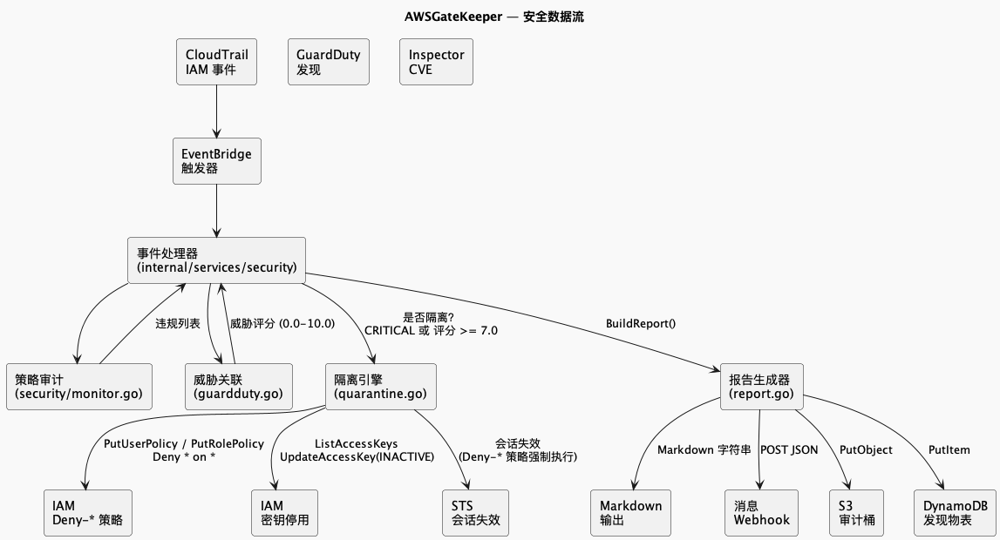

# 安全子系统




## 概述

安全子系统将三个 AWS 安全服务集成到统一的扫描编排管道中。它处理威胁发现、容器漏洞和根因调查，然后生成 Markdown 报告，并通过 HTTP 消息传递、S3 和 DynamoDB 进行投递。

## 架构

```
ScanOrchestrator.RunFullScan(ctx)
  │
  ├── [并行: errgroup]
  │   ├── GuardDuty.ListActiveFindings() → []GuardDutyFinding
  │   └── Inspector.ListContainerFindings() → []InspectorFinding
  │
  ├── [顺序: 逐条]
  │   ├── ForEach(ConfirmedCompromised) → DisableCompromisedCredentials()
  │   └── ForEach(Severity >= High) → Detective.InvestigateFinding()
  │
  └── 报告生成 + 投递
      ├── BuildReport() → Markdown 字符串
      ├── SendToMessagingEndpoint() → HTTP POST (goroutine)
      ├── SaveReportToS3() → s3://bucket/security-reports/YYYY/MM/DD/{id}.md
      └── SaveReportToDynamoDB() → table (goroutine)
```

## GuardDuty 集成

### 发现处理

`GuardDutyClient` 分页查询最近 N 小时内的活跃 GuardDuty 发现，获取每条发现的详细信息，并按严重级别、受损状态和网络扫描行为进行分类。

### 威胁分类

| 信号 | 检测方法 |
|--------|-----------------|
| 受损凭证 | 发现标题 + 类型关键词匹配 (CredentialExposure, UnauthorizedAccess, Stealth) |
| 网络扫描异常 | 标题 + 描述 + 类型关键词匹配 (Recon, PortProbe, NetworkPortUnusual) |

### 自动响应

当 `ConfirmedCompromised` 为 true 时：
1. 从发现资源 ARN 中提取 IAM 用户名
2. 列出该用户所有活跃的访问密钥
3. 通过 `iam:UpdateAccessKey` 将每个活跃密钥设为 INACTIVE

## Inspector 集成

### CVE 扫描

`InspectorClient` 从 Inspector v2 列出活跃发现，过滤容器镜像漏洞。每条发现解析后提取：

- CVE 标识符（如 `CVE-2024-1234`）
- CVSS 评分（所有 CVSS 向量中的最高 BaseScore）
- 受影响包名、当前版本和修复版本
- ECR 注册表、仓库和镜像标签
- 修复建议文本

### 严重级别映射

| Inspector 级别 | 内部级别 |
|-------------------|-------------------|
| CRITICAL | SeverityCritical |
| HIGH | SeverityHigh |
| MEDIUM | SeverityMedium |
| LOW | SeverityLow |
| INFORMATIONAL | SeverityInformational |

## Detective 集成

### 根因调查

对每条 High 及以上级别的 GuardDuty 发现，`DetectiveClient` 在回溯窗口内查询 CloudTrail 中涉及受影响资源 ARN 的所有事件。

### 异常检测

- **IP 跳变分析**：多个不同来源 IP 段 → 可能的凭证泄露
- **敏感操作检测**：AssumeRole、CreateAccessKey、AttachRolePolicy → 权限提升
- **时间线构建**：按时间排列的事件列表，包含用户 ARN、来源 IP 和事件详情

### 修复建议引擎

| 检测模式 | 建议 |
|-----------------|-----------------|
| 访问密钥创建 | 立即停用密钥；轮换凭证；启用 MFA |
| 角色代入 | 审查信任策略；强制 ExternalId；审计所有会话 |
| 未发现异常 | 人工审查；收紧 IAM 权限；启用 GuardDuty 异常检测 |

## 报告格式

`BuildReport` 函数生成 GitHub 风格 Markdown 报告：

1. 报告头（ID、时间戳）
2. 统计摘要
3. GuardDuty 发现表（严重级别、类型、标题、资源、受损状态）
4. Inspector CVE 表（严重级别、CVE、CVSS、包、镜像）
5. 根因调查结果及建议
6. 执行的自动操作

## 投递

| 目标 | 方法 | 触发条件 |
|-------------|--------|---------|
| S3 | `SaveReportToS3()` → `PutObject` | 每次扫描（需设置 `SECURITY_AUDIT_BUCKET`） |
| DynamoDB | `SaveReportToDynamoDB()` → `PutItem` | 每次扫描（需设置 `SECURITY_AUDIT_TABLE`） |
| 消息端点 | `SendToMessagingEndpoint()` → HTTP POST | 每次扫描（需设置 `SECURITY_MESSAGING_URL`） |

S3 和 DynamoDB 投递在后台 goroutine 中运行，不阻塞 HTTP 响应。

## 配置

| 环境变量 | 默认值 | 描述 |
|---------------------|---------|-------------|
| `GUARDDUTY_DETECTOR_ID` | *(必填)* | GuardDuty 检测器 ID |
| `SECURITY_LOOKBACK_HOURS` | `24` | 扫描回溯窗口 |
| `SECURITY_MESSAGING_URL` | `""` | 报告投递 HTTP 端点 |
| `SECURITY_AUDIT_BUCKET` | `""` | 报告持久化 S3 桶 |
| `SECURITY_AUDIT_TABLE` | `""` | 报告持久化 DynamoDB 表 |
